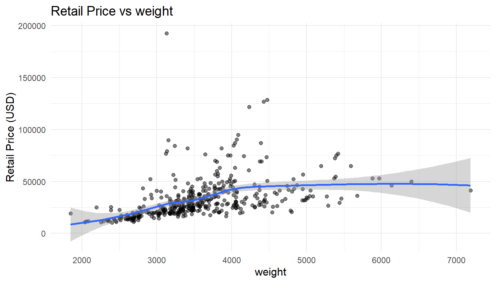
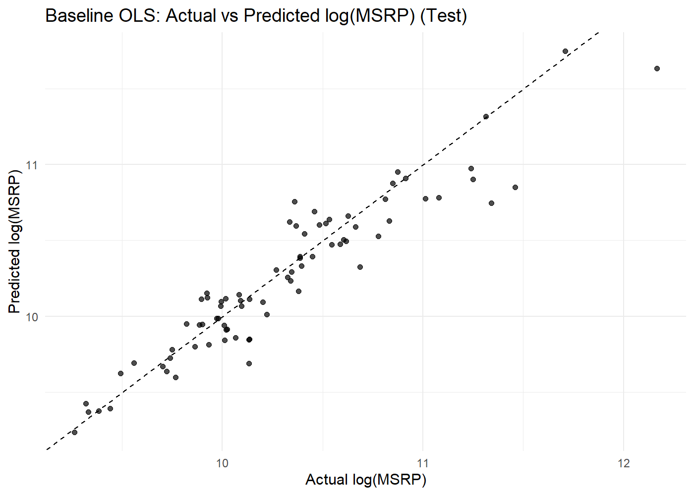
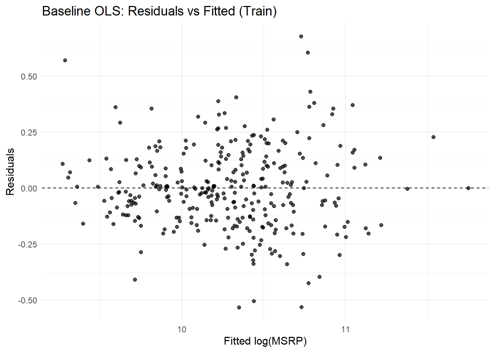
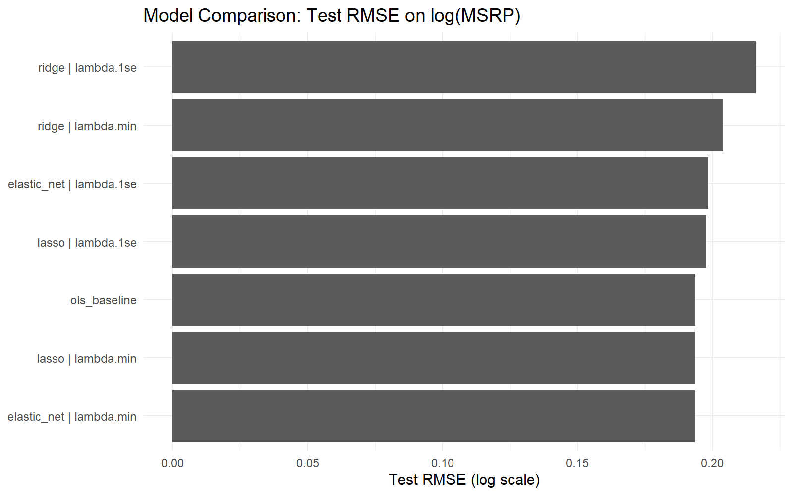
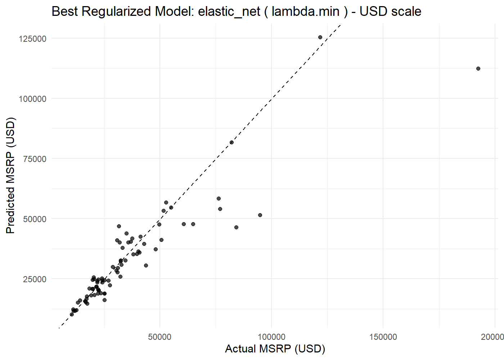
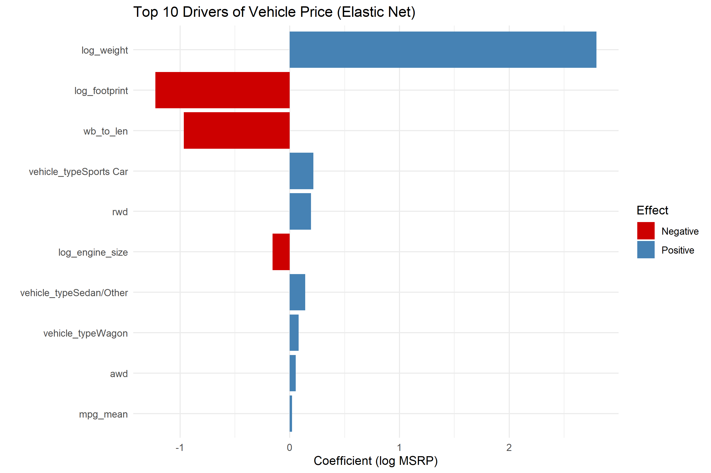

# Interpretable Modeling of New Vehicle Prices: Multicollinearity, Regularization, and Economic Structure

This project develops an **end-to-end interpretable regression pipeline** to model new vehicle prices using automotive characteristics such as:

- performance
- fuel economy
- drivetrain
- body type
- vehicle size

Rather than focusing only on predictive accuracy, the project emphasizes **economic interpretability and model stability**, combining multicollinearity diagnostics with modern regularization methods:

- Ridge Regression  
- Lasso Regression  
- Elastic Net  

The goal is to understand **what drives vehicle market value** and demonstrate how interpretable models can support:

- pricing strategy
- product positioning
- competitive benchmarking

---

# Problem Overview

Vehicle pricing reflects a combination of:

- engineering characteristics
- performance capability
- vehicle size and weight
- drivetrain configuration
- body style segmentation

Manufacturers must balance these factors when positioning vehicles in the market.

This project models vehicle prices using regression techniques to answer two key questions:

**1️. Which vehicle attributes drive price the most?**

**2️. How do we build stable, interpretable models when predictors are highly correlated?**

---

# Dataset

The dataset contains characteristics of **2004 model-year vehicles**.

Typical variables include:

- engine size
- horsepower
- vehicle weight
- fuel economy
- drivetrain (RWD / AWD)
- vehicle body type
- wheelbase and vehicle dimensions
- dealer cost and retail price

### Target Variable

**MSRP (Manufacturer Suggested Retail Price)**

Vehicle prices are right-skewed, so the modeling target uses:
log(MSRP)

---

# Project Workflow

The project follows a structured modeling pipeline:
EDA → Feature Engineering → Multicollinearity Diagnostics
→ OLS Baseline → Regularized Models → Model Interpretation

---

# Exploratory Data Analysis (EDA)

EDA was used to understand the **economic drivers of vehicle prices before modeling**.

Key findings include:

**Vehicle size strongly influences price**

Larger and heavier vehicles tend to command higher prices, reflecting both manufacturing costs and consumer demand for larger platforms.

**Performance characteristics matter**

Engine size and horsepower show strong positive relationships with price, particularly for performance-oriented vehicle segments.

**Vehicle segment effects**

Sports cars and luxury-oriented vehicles exhibit substantially higher prices compared to standard sedans and compact cars.

**Fuel economy tradeoffs**

Higher fuel economy vehicles tend to be associated with smaller vehicle platforms and lower price segments.

**Strong predictor correlations**

Several design variables — including engine size, horsepower, and weight — are highly correlated. This confirms the need for **multicollinearity diagnostics and regularized regression methods**.

These insights guided **feature engineering, model specification, and the use of regularization techniques** to produce stable and interpretable models.

### Relationship Between Vehicle Weight and Price

---

# Feature Engineering

Economically meaningful features were created, including:

- power-to-weight ratio
- average fuel efficiency
- vehicle footprint
- drivetrain indicators
- vehicle segment indicators

Log transformations were applied to stabilize skewed variables.

---

# Multicollinearity Diagnostics

Vehicle design variables are often **strongly correlated**.

To diagnose this, the project evaluates:

- pairwise correlations
- variance inflation factors (VIF)
- condition indices

These diagnostics identify instability in **ordinary least squares models**.

---

# Baseline Model: Ordinary Least Squares

An initial **Ordinary Least Squares (OLS)** regression model was built to establish a benchmark for predicting vehicle prices.

The model captures many expected economic relationships:

- Larger vehicles tend to have higher prices
- Higher horsepower and engine size generally increase price
- Sports car classifications command price premiums
- Rear-wheel drive configurations are associated with higher market value

### Model Diagnostics

Actual vs Predicted Prices

Residual Diagnostics

### Key Observations

While the OLS model captures general pricing trends, several issues appear:

**Coefficient instability**

Many engineering variables (engine size, horsepower, weight, vehicle footprint) are strongly correlated, leading to unstable coefficient estimates.

**Multicollinearity**

Variance Inflation Factor (VIF) diagnostics confirm substantial multicollinearity among design variables.

**Model sensitivity**

Small changes in predictors can lead to large swings in estimated coefficients, reducing interpretability.

### Motivation for Regularized Models

Because vehicle design variables are structurally correlated, standard OLS models can become unstable.

To address this, the analysis introduces **regularized regression methods** that shrink or select coefficients to improve model stability and predictive performance:

- Ridge Regression
- Lasso Regression
- Elastic Net

### Actual vs Predicted Prices

### Residual Diagnostics

These diagnostics highlight why **multicollinearity can affect coefficient stability**.

---

# Regularized Regression Models

To address multicollinearity and improve generalization, the project compares:

- Ridge Regression
- Lasso Regression
- Elastic Net

These models shrink or select coefficients to produce **more stable predictions**.

### Model Comparison

Elastic Net achieves the best balance between:

- predictive performance
- interpretability

---

# Elastic Net Model Performance

Predicted vs Actual vehicle prices using the **best regularized model**:

The model captures most variation in vehicle prices while maintaining interpretable coefficients.

---

# Key Drivers of Vehicle Price

The Elastic Net model identifies the most influential features affecting vehicle prices.

Major drivers include:

- vehicle weight
- vehicle footprint
- sports car classification
- rear-wheel drive
- engine size

These results reflect real automotive market dynamics:

- heavier vehicles often indicate larger platforms or luxury features
- sports cars command premium pricing
- drivetrain and performance characteristics affect positioning

---

# Repository Structure
vehicle-price-modeling
│
├── data
│ └── raw dataset
│
├── scripts
│ ├── 01_data_exploration.R
│ ├── 02_multicollinearity_diagnostics.R
│ ├── 03_feature_engineering.R
│ ├── 04_linear_model_baseline.R
│ ├── 05_regularized_models.R
│ └── 06_model_interpretation.R
│
└── modeling figures

---

# Business Applications

This analysis demonstrates how interpretable models can support:

### Pricing Strategy
Understanding how vehicle attributes contribute to price helps guide MSRP decisions.

### Product Positioning
Manufacturers can identify which design features most strongly influence perceived value.

### Competitive Benchmarking
Automakers can compare vehicles with similar characteristics to identify pricing gaps.

---

# Tools Used

- R  
- ggplot2  
- dplyr  
- glmnet  
- readr  

---

